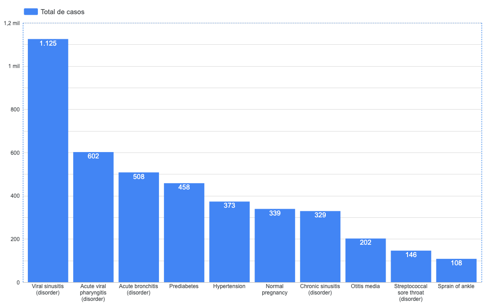
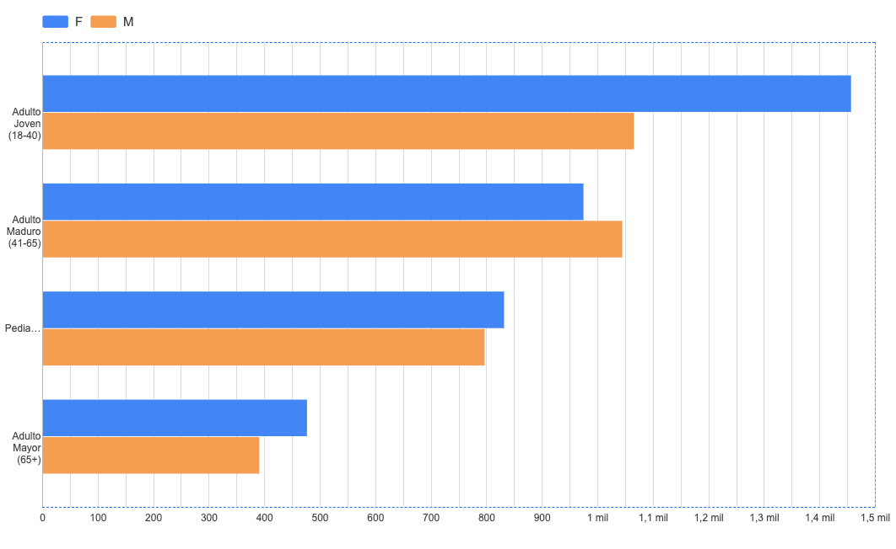

# 🏥 Análisis de Salud Digital: Prevalencia y Carga Operativa

### 📋 Descripción del Proyecto
Este proyecto utiliza datos de **Synthea (vía Kaggle)** para simular un análisis de salud poblacional. Como médico transicionando a datos, mi enfoque fue corregir la métrica de edad para reflejar la realidad clínica y analizar qué diagnósticos impactan más en la operación de una clínica.

### 🛠️ Stack Tecnológico
- **Cloud Data Warehouse:** Google BigQuery.
- **Lenguaje:** SQL (GoogleSQL).
- **Visualización:** Looker Studio.

### 💡 Hallazgos Principales
1. **Corrección Epidemiológica:** Al utilizar la edad al diagnóstico, se identificó una prevalencia real de enfermedades respiratorias en pediatría que antes se diluía.
2. **Carga Operativa:** La *Sinusitis Viral* representa el 15% del volumen total de registros, sugiriendo la implementación de protocolos de seguimiento remoto.
3. **Perfil del Paciente:** El 60% de la población de "Alto Costo" (múltiples diagnósticos) se concentra en el segmento Adulto Maduro.

### 📊 Dashboard Interactivo
Puedes interactuar con los datos aquí: (https://lookerstudio.google.com/s/uRsDpJj75Cc)

## Visualización de Datos

### 1. Top 10 Diagnósticos (Carga Clínica)

*Análisis de las principales causas de consulta en la población estudiada.*

### 2. Distribución Poblacional por Género y Edad

*Cruce de variables demográficas para entender el perfil del paciente de la clínica.*

### 3. Mapa de Carga Operativa (Treemap)

*Visualización proporcional del volumen de registros por diagnóstico.*
